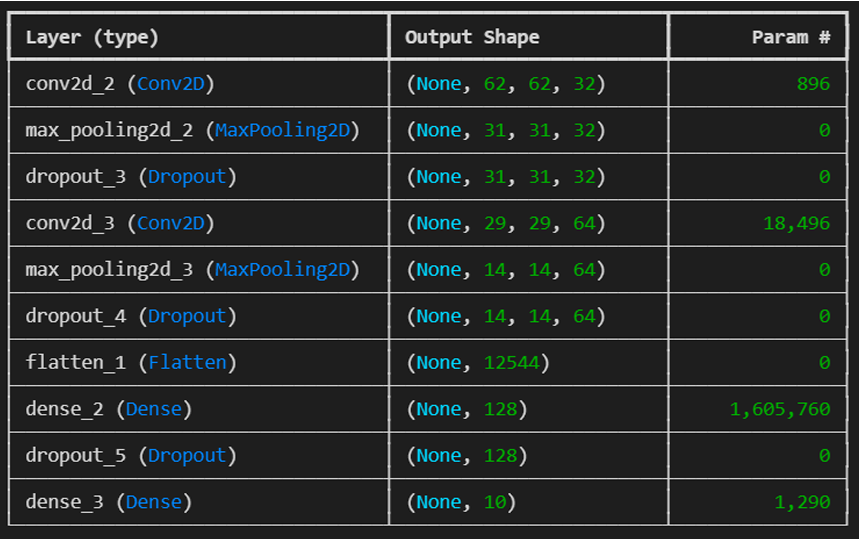
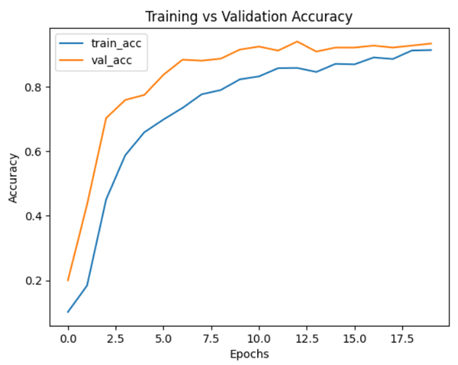
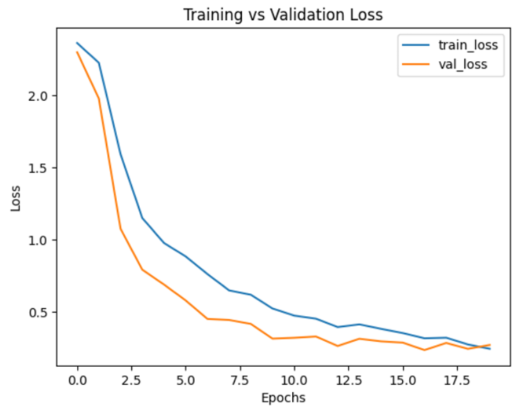
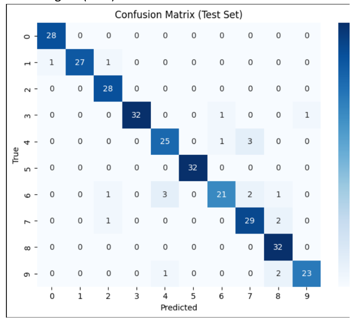

# Hand Gesture Recognition for Sign Language Digits using Deep Convolutional Neural Networks

A deep learning project that recognizes Sign Language Digits (0–9) using a Convolutional Neural Network (CNN) built with TensorFlow/Keras. The model classifies hand gesture images into their corresponding digit with an overall **93.3% test accuracy**.

---

# Overview

Communication through sign language is essential for the hearing-impaired community. This project aims to automate the recognition of American Sign Language (ASL) digits (0–9) using a CNN model trained on grayscale hand gesture images.

The model incorporates several regularization techniques including:

- Dropout
- L2 Regularization
- Early Stopping

These techniques improve generalization and reduce overfitting.

---

# Features

- Deep Convolutional Neural Network (CNN)
- Image preprocessing and normalization
- Hyperparameter tuning
- Early stopping to prevent overfitting
- Confusion Matrix visualization
- Accuracy and Loss analysis
- Classification report (Precision, Recall, and F1-score)
- ROC-AUC evaluation

---

# Dataset

Dataset: Sign Language Digits Dataset

- Images of digits 0–9
- Image size: 64 × 64
- RGB images

Dataset split:

- 70% Training
- 15% Validation
- 15% Testing

---

# Technologies Used

- Python
- TensorFlow / Keras
- NumPy
- Matplotlib
- Seaborn
- Scikit-learn

---

# Model Architecture

The CNN consists of the following layers.

| Layer | Details |
|--------|---------|
| Conv2D | 32 Filters (3×3), ReLU, L2 Regularization |
| MaxPooling2D | 2×2 |
| Dropout | 0.25 |
| Conv2D | 64 Filters (3×3), ReLU |
| MaxPooling2D | 2×2 |
| Dropout | 0.25 |
| Flatten | Feature Vector |
| Dense | 128 Neurons, ReLU |
| Dropout | 0.5 |
| Output | Dense (10), Softmax |

## Model Summary

<p align="center">

</p>

---

# Training Configuration

| Parameter | Value |
|-----------|-------|
| Optimizer | Adam |
| Learning Rate | 0.001 |
| Batch Size | 32 |
| Epochs | 20 |
| Loss Function | Sparse Categorical Crossentropy |
| Early Stopping | Patience = 5 |
| L2 Regularization | λ = 0.001 |

---

# Training Performance

## Accuracy Curve

The model steadily improved throughout training and reached approximately 93% validation accuracy, demonstrating strong generalization.

<p align="center">

</p>

---

## Loss Curve

Both training and validation losses decreased consistently, indicating stable learning with minimal overfitting.

<p align="center">

</p>

---

# Model Evaluation

## Confusion Matrix

The confusion matrix shows that most hand gestures were correctly classified. Minor confusion exists among visually similar gestures such as digits 4, 6, and 9.

<p align="center">

</p>

---

## Performance Metrics

| Metric | Score |
|---------|-------|
| Test Accuracy | **93.3%** |
| Precision | **93%** |
| Recall | **93%** |
| F1-Score | **93%** |

---

## Hyperparameters

- Learning Rate: 0.001
- Batch Size: 32
- Epochs: 20
- Dropout: 0.25 and 0.5
- L2 Regularization: 0.001
- Early Stopping Patience: 5

---

# Project Structure

```text
Hand-Gesture-Recognition/
│
├── Dataset/
│
├── images/
│   ├── accuracy_curve.png
│   ├── loss_curve.png
│   ├── confusion_matrix.png
│   └── model_summary.png
│
├── model.ipynb
├── train.py
├── requirements.txt
└── README.md
```

---

# Future Improvements

- Real-time webcam gesture recognition
- Mobile deployment using TensorFlow Lite
- Transfer learning with pre-trained CNN models
- Continuous sign language sentence recognition
- Support for dynamic gestures

---

# References

- TensorFlow Documentation
- Keras API Documentation
- Scikit-learn Documentation
- Kaggle Sign Language Digits Dataset

---

# Author

**Kashaf Fatima**

AI and Software Engineer

Email: **kashaf.fatimaa132@gmail.com**

GitHub: *Add your GitHub profile link*

LinkedIn: *Add your LinkedIn profile link*

---

If you found this project useful, consider starring the repository.
